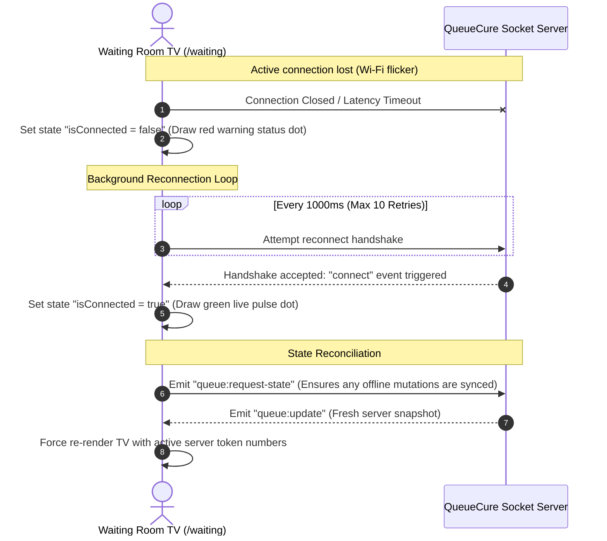

# QueueCure 📊 Data Synchronization Diagrams

This document outlines the real-time event loops and synchronization lifecycles of **QueueCure** using Mermaid Sequence diagrams.

---

## 1. Core Event Flow: Patient Onboarding and Token Calling

This diagram shows the complete lifecycle: client joining, state fetching, and real-time synchronization when a receptionist advances the active patient.

```mermaid
sequenceDiagram
    autonumber
    actor Rec as Receptionist Console (/reception)
    actor TV as Waiting Room TV (/waiting)
    participant S as QueueCure Socket Server
    participant DB as JSON Storage (data.json)

    note over Rec, S: Initial Connection Sequence
    Rec->>S: Establish Socket Connection
    TV->>S: Establish Socket Connection
    S-->>Rec: Emit initial "queue:update" payload (on connect)
    S-->>TV: Emit initial "queue:update" payload (on connect)

    note over TV, S: Late-joining TV synchronization
    TV->>S: Emit "queue:request-state"
    S-->>TV: Emit "queue:update" (Full state payload)
    TV->>TV: Re-render display with live estimates

    note over Rec, DB: Consultation Advance event (Call Next)
    Rec->>S: Emit "queue:call-next"
    rect rgb(30, 41, 59)
        note over S, DB: Server-side logic execution
        S->>S: Retrieve active queue
        S->>S: Mark current "in-progress" token as "done"
        S->>S: Pull next "waiting" token & set to "in-progress"
        S->>S: Recalculate downstream wait times (elapsed modifier)
        S->>DB: Persist modified Queue to disc (data.json)
    end
    S-->>Rec: Broadcast updated "queue:update" with full active queue
    S-->>TV: Broadcast updated "queue:update" with full active queue

    note over Rec, TV: Client UI updates
    Rec->>Rec: Auto-focus name field & trigger 10-second undo bar
    TV->>TV: Animate new token progression banner & restart duration timer
```

---

## 2. Reconnection Recovery Sequence

This diagram shows how QueueCure handles temporary internet dropouts (like minor Wi-Fi ripples in clinics), guaranteeing that no terminal boards drift out of sync.

